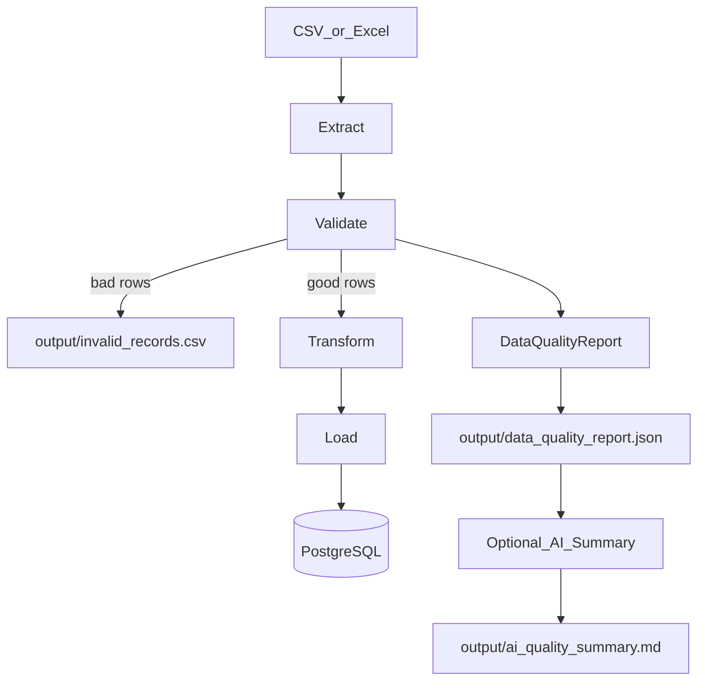

# Python ETL Pipeline — Implementation Plan

## What you are building (in plain English)

A **batch ETL pipeline**: a Python program that runs on demand, reads order data from a file, cleans it, and writes good rows into PostgreSQL.

| Term | Meaning |
|------|---------|
| **Extract** | Read CSV/Excel into memory (pandas DataFrame) |
| **Transform / Validate** | Check rules, fix formats, compute `total_amount`, split good vs bad rows |
| **Load** | Upsert into `dim_customer`, `dim_product`, `fact_order` |
| **Idempotent** | Running the same file twice does not create duplicate orders |
| **Deterministic vs AI** | Python/SQL do all processing; the LLM only summarizes metrics |



**Target layout** (project root will be this workspace, or a `python-etl-pipeline/` folder — we will use the workspace root `d:\AI\Test` and create the structure from [Master_Document.md](Master_Document.md) §20 under it):

```
data/input/  data/sample/
output/  logs/
src/   (config, logger, extract, validate, transform, load, quality, ai_summary, main)
tests/
.env.example  .gitignore  requirements.txt  README.md  pyproject.toml
```

**Stack (required only):** Python 3.11+, pandas, openpyxl, PostgreSQL, SQLAlchemy, python-dotenv, pytest, logging, OpenAI/Azure OpenAI for the optional summary. No Docker, Airflow, FastAPI, Spark, etc.

---

## How we will work (critical)

Per §26–§30 of the master doc:

1. Implement **one step only**.
2. Stop and explain: what was built, Python concepts, how to run/test, what the next step does.
3. **Wait** until you say to continue (e.g. “do Step 2”).
4. Prefer simple functions over classes and frameworks.

When you approve this plan, **implementation starts at Step 1 only**.

---

## Beginner concepts you will meet early

- **Virtual environment (`venv`)**: isolated folder of packages so project deps do not mix with system Python.
- **`requirements.txt`**: pinned list of libraries (`pip install -r requirements.txt`).
- **Package + module**: `src/` with `__init__.py`; run entry as `python -m src.main`.
- **pandas DataFrame**: table in memory (rows × columns).
- **`.env` + dotenv**: secrets (DB password, API key) outside code; never commit `.env`.
- **logging**: structured messages to `logs/pipeline.log` instead of `print`.
- **pytest**: small tests that call your functions with fake data and assert results.
- **SQLAlchemy**: Python API to connect, define tables, and upsert into PostgreSQL.

---

## Step-by-step implementation

### STEP 1 — Project skeleton and environment

**Goal:** Empty but runnable project; no ETL yet.

**Create:**
- Folders: `data/input`, `data/sample`, `output`, `logs`, `src`, `tests`
- [`requirements.txt`](requirements.txt): pandas, openpyxl, SQLAlchemy, psycopg2-binary, python-dotenv, pytest, openai (or azure SDK later as needed)
- [`.gitignore`](.gitignore): `.env`, `venv/`, `__pycache__/`, `logs/`, etc.
- [`.env.example`](.env.example): `DB_HOST`, `DB_PORT`, `DB_NAME`, `DB_USER`, `DB_PASSWORD`, optional `OPENAI_API_KEY`
- Minimal [`src/__init__.py`](src/__init__.py), [`src/main.py`](src/main.py) that logs/prints “Pipeline skeleton ready”
- Starter [`README.md`](README.md) with venv setup for Windows PowerShell

**You learn:** venv, packages, `python -m`, project layout.

**Done when:** `python -m src.main` prints a confirmation. Then **STOP**.

---

### STEP 2 — Sample data

**Goal:** Synthetic orders (≈1000–5000 rows) for CSV and XLSX, with intentional bad data.

**Create:** generator script or one-off generation into `data/sample/` (and optionally copy into `data/input/`), schema note in README.

**Columns:** `order_id`, `customer_id`, `customer_name`, `customer_email`, `order_date`, `product_id`, `product_name`, `quantity`, `unit_price`, `order_status`, `country`

**Inject issues:** missing emails/IDs/names, bad dates, qty ≤ 0, negative price, bad status, duplicate `order_id`.

**You learn:** CSV vs Excel, why test data must include failures.

**Done when:** both files exist and you can open/inspect them. Then **STOP**.

---

### STEP 3 — Extract (`src/extract.py`)

**Goal:** File → DataFrame only.

**Behavior:** detect `.csv` / `.xlsx` by extension; `pandas.read_csv` / `read_excel`; raise clear errors for missing/unsupported files; log row count.

**Also:** [`src/logger.py`](src/logger.py) (file + console), light tests if practical.

**You learn:** pandas I/O, `Path`, exceptions, logging.

**Done when:** calling extract on sample data returns a DataFrame and logs count. Then **STOP**.

---

### STEP 4 — Validate (`src/validate.py`)

**Goal:** Deterministic rules; split valid vs invalid; never use LLM.

**Rules:** required non-null fields; `quantity > 0`; `unit_price >= 0`; status in `PENDING|COMPLETED|CANCELLED|RETURNED`; valid `order_date`; detect duplicate `order_id` (keep one for load path; mark extras invalid).

**Output:** invalid rows → `output/invalid_records.csv` with `validation_error` (all failures on a row concatenated).

**You learn:** boolean masks in pandas, collecting error strings, separating clean/dirty data.

**Done when:** valid/invalid DataFrames + invalid CSV can be produced from sample data. Then **STOP**.

---

### STEP 5 — Transform (`src/transform.py`)

**Goal:** Shape clean rows for the warehouse; no DB code.

**Work:** snake_case columns; trim strings; parse dates; types; `total_amount = quantity * unit_price`; build three frames for customer / product / fact.

**You learn:** DataFrame column ops, derived columns, preparing dimension vs fact slices.

**Done when:** from valid rows you get three load-ready tables in memory. Then **STOP**.

---

### STEP 6 — PostgreSQL model + connection

**Goal:** Schema + connection only; no full load yet.

**Tables (star-style):**
- `dim_customer` (PK `customer_id`)
- `dim_product` (PK `product_id`)
- `fact_order` (PK `order_id`, FKs to dims, includes `total_amount`)

**Also:** [`src/config.py`](src/config.py) reading `.env`; SQLAlchemy engine/session; `create_all` (or equivalent) to create tables.

**You learn:** relational keys, ORM/table metadata, connection strings, secrets via env.

**Prereq for you:** local PostgreSQL running and a DB (e.g. `etl_demo`) matching `.env`.

**Done when:** connecting creates empty tables you can see in a SQL client. Then **STOP**.

---

### STEP 7 — Load (`src/load.py`)

**Goal:** Upsert dims then facts; idempotent on `order_id`.

**Order:** customers → products → orders. Use PostgreSQL `ON CONFLICT ... DO UPDATE` (via SQLAlchemy) — **not** truncate-and-reload. Log insert/update counts.

**You learn:** batch writes, upserts, why load order respects FKs.

**Done when:** loading twice does not duplicate `fact_order` rows. Then **STOP**.

---

### STEP 8 — End-to-end CLI (`src/main.py`)

**Goal:** Wire Extract → Validate → Transform → Load → report hooks; argparse `--input`.

**Commands:**
```text
python -m src.main --input data/input/orders.csv
python -m src.main --input data/input/orders.xlsx
```

**Behavior:** fatal errors (missing file, DB down) → non-zero exit; invalid rows alone do **not** fail the run; logs to `logs/pipeline.log`.

**You learn:** CLI args, orchestrating modules, exit codes.

**Done when:** one command runs the full happy path on sample input. Then **STOP**.

---

### STEP 9 — Data quality report (`src/quality.py`)

**Goal:** Deterministic JSON at `output/data_quality_report.json` (counts, nulls, duplicates, status). Metrics computed in Python only.

**Done when:** report matches pipeline run numbers. Then **STOP**.

---

### STEP 10 — AI summary (`src/ai_summary.py`)

**Goal:** Send **already computed** metrics to OpenAI/Azure OpenAI; write `output/ai_quality_summary.md`. On API failure: ETL still SUCCESS, summary = UNAVAILABLE. LLM never validates, loads, or changes data.

**You learn:** optional side-channel vs core pipeline; try/except isolation.

**Done when:** success path writes markdown; forced API failure still completes ETL. Then **STOP**.

---

### STEP 11 — Testing (pytest)

**Focus:** validate, transform, quality (+ extract where useful). No LLM tests required. Deterministic fixtures (small in-memory DataFrames).

**Done when:** `pytest` passes. Then **STOP**.

---

### STEP 12 — Cleanup and documentation

**Goal:** Interview-ready README (purpose, architecture, stack, schema, validation, Postgres setup, run/test, sample output, AI decision, limitations). No new features.

**Done when:** Definition of Done in §28 is satisfiable and you can explain each module.

---

## Definition of Done (checklist)

You can place a file in `data/input/`, run one CLI command, see validation + invalid CSV + Postgres load, re-run without duplicate orders, get JSON DQ report + AI summary (or UNAVAILABLE), and pass pytest — and explain each module in an interview.

---

## What happens right after you approve this plan

1. Implement **Step 1 only** (folders, deps, `.env.example`, minimal `src.main`).
2. Explain concepts and how to create/activate the venv on Windows.
3. Stop and wait for you to request Step 2.

No PostgreSQL or OpenAI keys are required until Steps 6 and 10 respectively.
